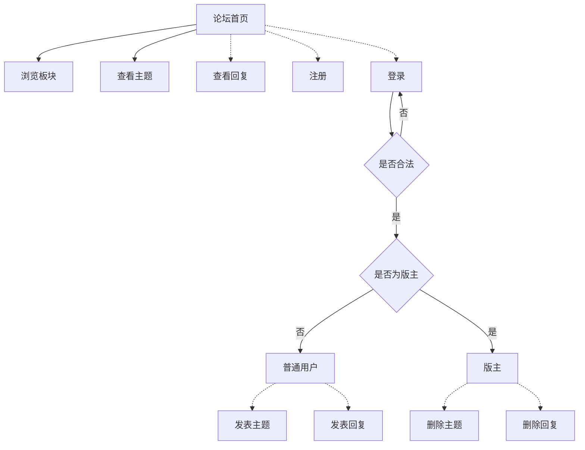
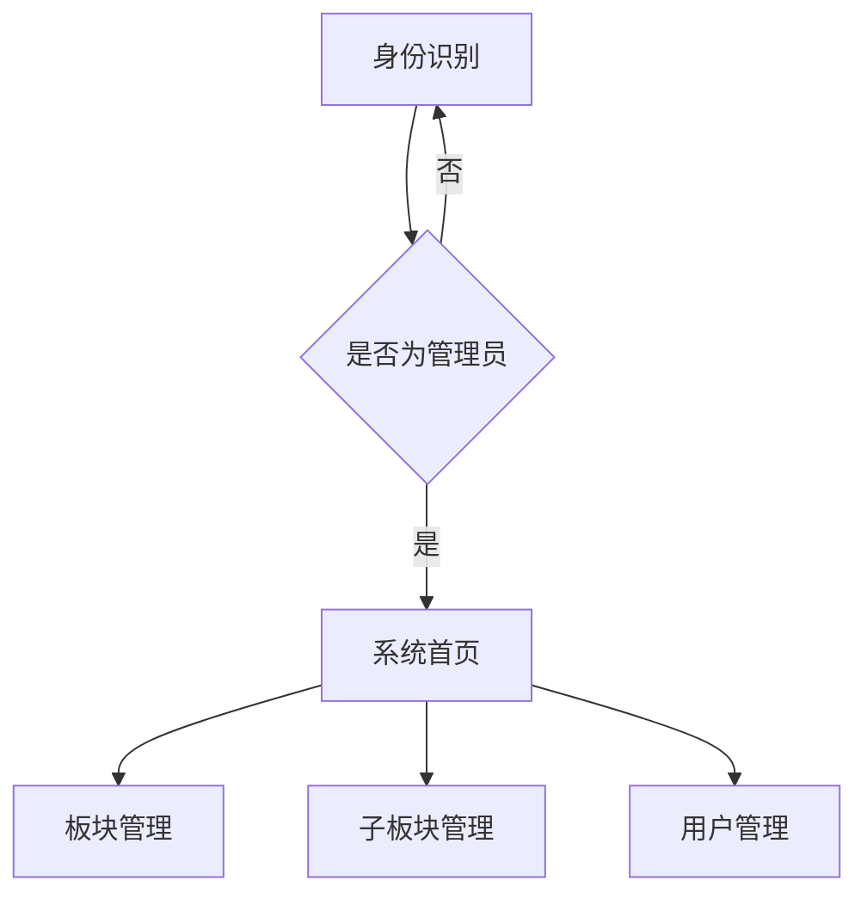

# 企业论坛系统

## 系统分析

* 前台
  * 注册
  * 登陆
  * 浏览
  * 回复
* 后台
  * 板块管理
  * 子板块管理
  * 用户管理

## 功能分析

* 前台

  * 板块列表模块

    显示所有模块及其子版块，显示子板块下的主题数目、最后发言记录

  * 主题列表模块

    显示指定板块下的所有主题信息，显示主题的发表者和回复数

  * 显示主题详细内容模块

    显示主题的详细信息和所有回复信息

* 后台

  * 板块设置模块

    管理论坛的模块和子模块信息，包括新增板块、编辑板块、删除板块、移动板块

  * 用户设置模块

    管理用户信息，包括新增用户、更新用户、删除用户、查询用户

## 系统设计

### 用例

| 用户     | 权限                                                         |
| -------- | ------------------------------------------------------------ |
| 普通用户 | 浏览论坛，发表主题，回复信息                                 |
| 版主     | 浏览论坛，发表主题，回复信息，修改主题和回复，删除主题和回复 |
| 管理员   | 浏览论坛，发表主题，回复信息，修改主题和回复，删除主题和回复，管理板块信息，管理用户信息 |

### 流程

前台：



后台：



### 开发技术

Java开发包：JDK 5.0以上

Web服务器：Tomcat

使用MVC架构：

* View层，使用JSP开发
* Control层，使用Servlet开发
* Model层，使用JavaBean开发
* 数据库访问层，使用DAO模式开发

文件夹结构：

```
..
└--src                        Java源文件
	└--com
		├--dao                数据库访问层代码
		├--entity             实体类代码
		├--match              校验类代码
		├--page               分页工具代码
		└--servlet            Servlet类代码
└--WebRoot
	├--image                  图片文件
	├--manager                网站后台文件
	├--META-INF
	├--style                  样式文件
	├--WEB-INF                配置文件
```

## 数据库设计

### 数据库概念设计

设计4个实体：板块信息实体、主题信息实体、回复信息实体、用户信息实体。

板块信息实体（sectionInfo）：板块编号，板块名称，版主编号，帖子数目，父板块编号。

主题信息实体（topicInfo）：帖子编号，所属板块编号，发贴用户编号，帖子标题，帖子内容，回复数量，点击数量，发帖时间，修改时间。

回复信息实体（replyInfo）：跟帖编号，回复主帖编号，跟帖所在版块编号，跟帖人编号，跟帖主题，跟贴内容，跟帖时间，修改时间。

用户信息实体（userInfo）：用户编号，用户名，用户密码，用户性别，用户头像路径，用户注册时间，用户类型。

### 数据库逻辑结构设计

sectionInfo：

| 字段名      | 数据类型 | 是否主键 | 描述       |
| ----------- | -------- | -------- | ---------- |
| sId         | int      | 是       | 板块编号   |
| sName       | varchar  | 否       | 板块名称   |
| sTopicCount | int      | 否       | 帖子数目   |
| sMasterId   | int      | 否       | 版主编号   |
| sParentId   | int      | 否       | 父板块编号 |

topicInfo：

| 字段名       | 数据类型 | 是否主键   | 描述         |
| ------------ | -------- | ---------- | ------------ |
| tId          | int      | 是         | 帖子编号     |
| tSId         | int      | 否（外键） | 所属板块编号 |
| tUId         | int      | 否（外键） | 发贴用户编号 |
| tTopic       | varchar  | 否         | 帖子标题     |
| tContents    | varchar  | 否         | 帖子内容     |
| tReplyCount  | int      | 否         | 回复数量     |
| tClickCount  | int      | 否         | 点击数量     |
| tPublishTime | time     | 否         | 发帖时间     |
| tModifyTime  | time     | 否         | 修改时间     |

replyInfo：

| 字段名       | 数据类型 | 是否主键   | 描述       |
| ------------ | -------- | ---------- | ---------- |
| rId          | int      | 是         | 跟帖编号   |
| rTId         | int      | 否         | 主帖编号   |
| rSId         | int      | 否（外键） | 板块编号   |
| rUId         | int      | 否（外键） | 跟帖人编号 |
| rTopic       | varchar  | 否         | 跟帖主题   |
| rContents    | varchar  | 否         | 跟贴内容   |
| rPublishTime | time     | 否         | 跟帖时间   |
| rModifyTime  | time     | 否         | 修改时间   |


userInfo：

| 字段名    | 数据类型 | 是否主键 | 描述         |
| --------- | -------- | -------- | ------------ |
| uId       | int      | 是       | 用户编号     |
| uName     | varchar  | 否       | 用户名       |
| uPassword | varchar  | 否       | 用户密码     |
| uSex      | bit      | 否       | 用户性别     |
| uFace     | varchar  | 否       | 用户头像路径 |
| uRegTime  | time     | 否       | 用户注册时间 |
| uType     | int      | 否       | 用户类型     |

## 公共类设计

### 板块信息类

`com\entity\SectionInfo.java`

```java
public class SectionInfo{
    private Integer sid;            //板块编号
    private String sname;           //板块名
    private Integer smasterid;      //版主编号
    private Integer stopiccount;    //帖子数量
    private Integer sparentid;      //父板块编号
    //省略setter和getter方法
}
```

### 主题信息类

`com\entity\TopicInfo.java`

```java
public class TopicInfo{
    private Integer tid; // 帖子编号
    private Integer tsid; // 帖子所在版块编号
    private Integer tuid; // 发帖用户编号
    private String ttopic; // 帖子标题
    private  String tcontents; // 帖子内容
    private Integer treplycount; // 回复数量
    private Integer rclickcount; // 点击数量
    private Date tpublishtime; // 发帖时间
    private Date tmodifytime; // 修改时间
    // 省略setter和getter方法
}
```

### 回复信息类

`com\entity\ReplyInfo.java`

```java
public class TopicInfo{
    private Integer tid; // 跟帖编号
    private Integer rtid; // 回复的主帖编号
    private Integer rsid; // 跟帖的板块编号
    private Integer ruid; // 跟帖人编号
    private String rtopic; // 跟贴主题
    private String rcontents; // 跟贴内容
    private Date rpublishtime; // 跟帖时间
    private Date rmodifytime; // 修改时间
    // 省略setter和getter方法
}
```

### 用户信息类

`com\entiey\UserInfo.java`

```java
public class UserInfo{
    private Integer uid; // 用户编号
    private String uname; // 用户名
    private String upassword; // 用户密码
    private Boolean usex; // 用户性别
    private String uface; // 用户头像
    private Date uregtime; // 用户注册时间
    private Integer utype; // 用户类型
    // 省略setter和getter方法
}
```

## 后台开发

### 新增板块数据校验

### 新增板块数据访问层

### 完成板块添加

### 显示板块导航管理树

### 板块信息编辑

### 板块信息删除

## 前台开发

### 首页

### 显示板块下所有主题

### 显示主题详细内容

### 发表主题

### 发表回复

